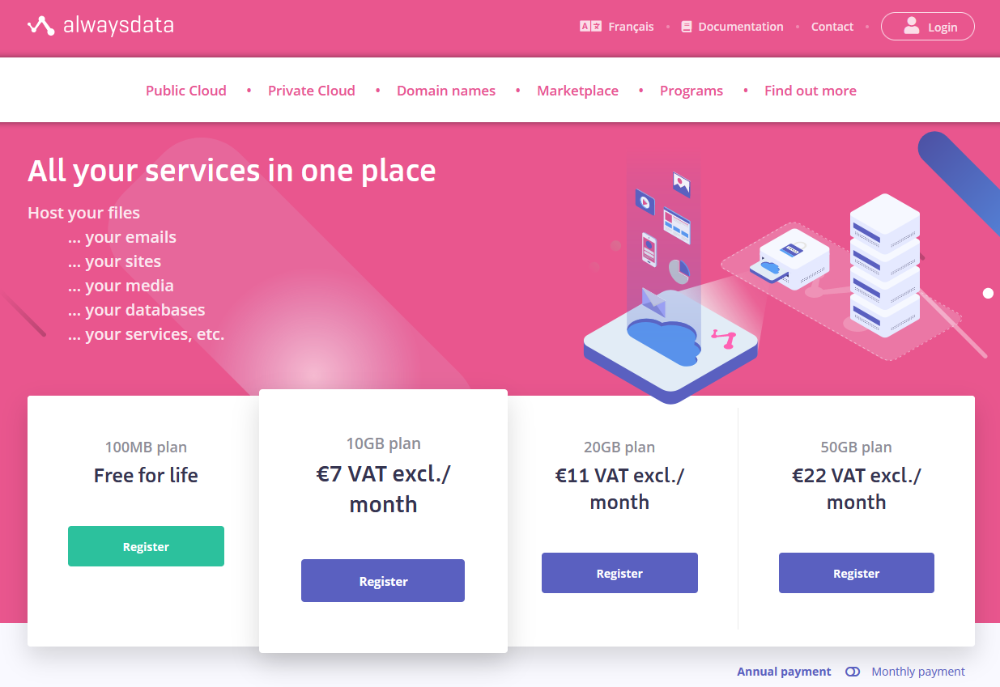
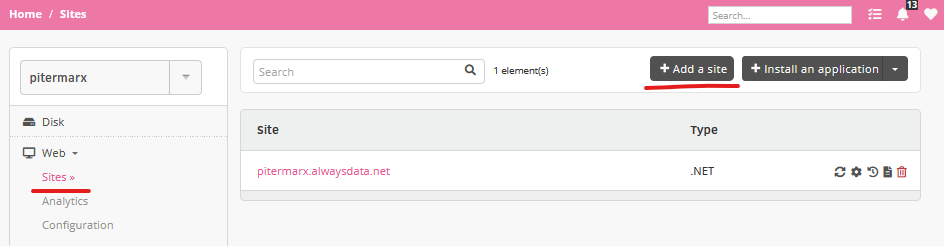
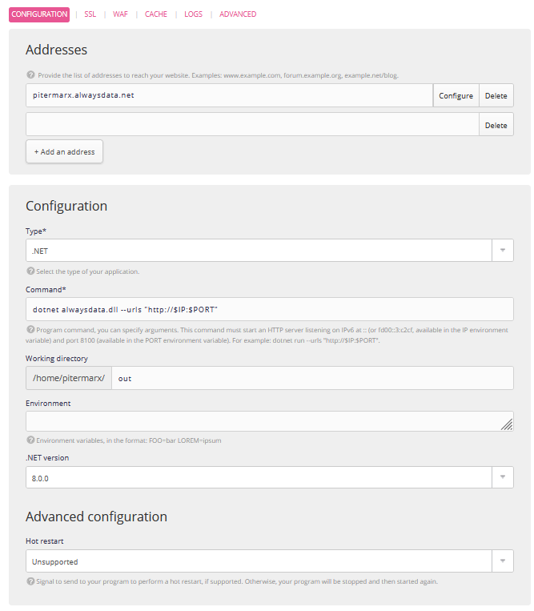
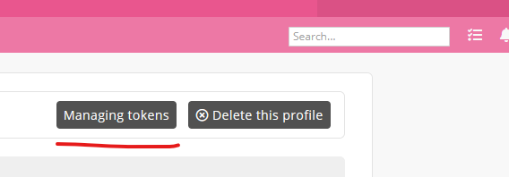
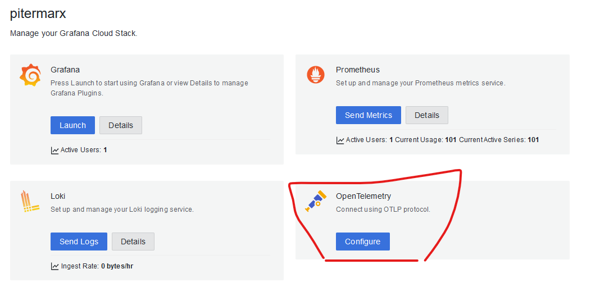
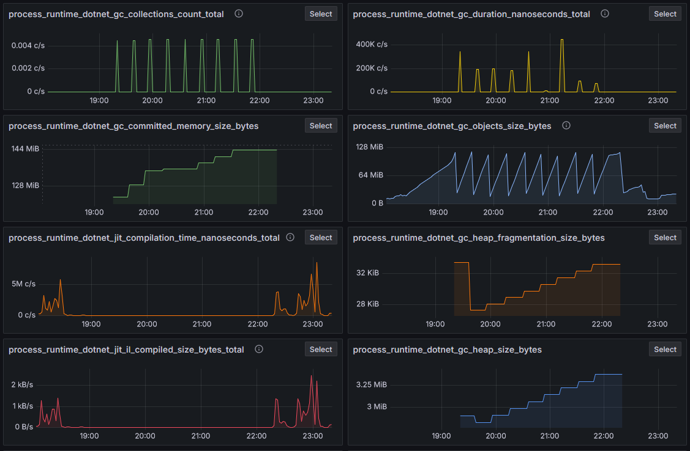
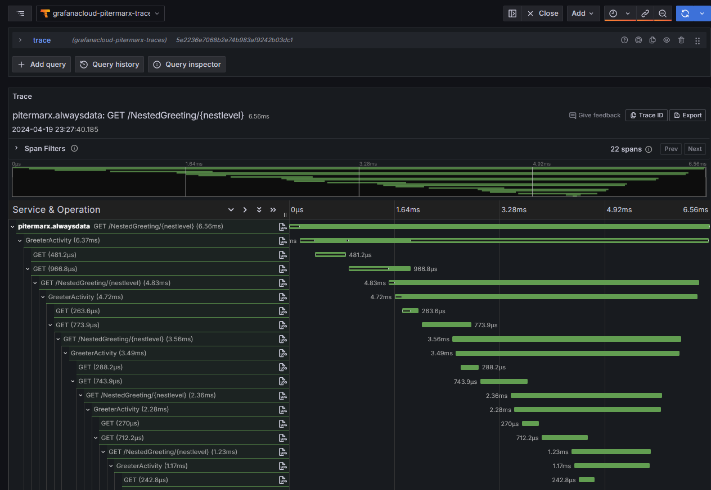
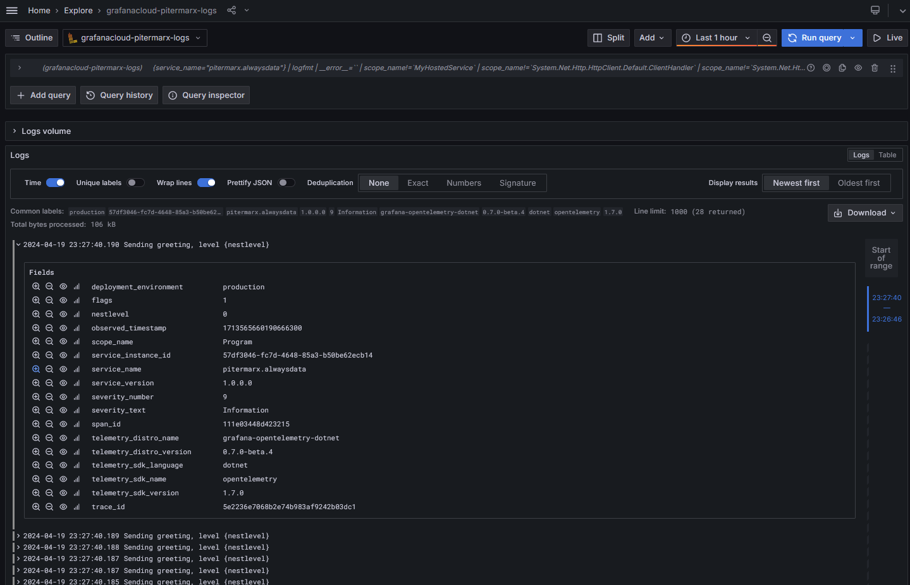

I've been wanting to test the new features of dotnet, and language syntax, and also to learn more about observability and specifically OpenTelemetry.

Since I'm cheap, I wanted to find a free host to test this.

## Part 1 - Create Simple API
In this first part I just want a simple aspnet project running. Nothing fancy, just build and deploy.

My first idea was to use the Azure free tier, but it required a credit card to sign up, so I gave up.

After searching I ended up choosing [AlwaysData](https://www.alwaysdata.com/en/), which is a hosting provider that offers a free tier that has a server with dotnet 8.0 already pre-installed, as well as ssh access, with 100Mb of storage. It also offers managed databases, which I want to explore later. It also offers free https for your websites. Thank you AlwaysData! You are very generous!



### Simple minimal Api 

I simply used the `dotnet new web` command to create a new web api project.

It scaffolds for me the csproj, and the Program.cs files.

#### alwaysdata.csproj

```xml
<Project Sdk="Microsoft.NET.Sdk.Web">

  <PropertyGroup>
    <TargetFramework>net8.0</TargetFramework>
    <Nullable>enable</Nullable>
    <ImplicitUsings>enable</ImplicitUsings>
  </PropertyGroup>

</Project>
```

#### Program.cs

```cs
var builder = WebApplication.CreateBuilder(args);
var app = builder.Build();

app.MapGet("/", () => "Hello World!");

app.Run();
```

To make this ready to deploy it's simply a matter of running the publish command, targeting linux as the runtime

The following command creates an "out" directory with all the necessary assets.

```bash
dotnet publish -o out -r linux-x64 
```

### AlwaysData setup

To setup the website I did the following steps.

Firstly, I created the website



Configured all the parameters, I set the app to run on a directory called "out" (not the greatest name...)



### Deploy

Then after [configuring SSH](https://help.alwaysdata.com/en/remote-access/ssh/use-keys/), I'm ready to deploy

```powershell
# Build
dotnet publish app -o out -r linux-x64 
# Powershell zip compression
Compress-Archive out out.zip
# Copy to the host
scp out.zip pitermarx@ssh-pitermarx.alwaysdata.net:~
# ssh to the host, remove old app, unzip uploaded file, delete zip
ssh pitermarx@ssh-pitermarx.alwaysdata.net 'rm out -rf;unzip out.zip;rm out.zip'
```

A final step, to make sure everything is working is to restart the app. I do this via the [alwaysdata API](https://help.alwaysdata.com/en/api/).

Also with a bit of powershell magic, this is easily done

```powershell
function toBase64([Parameter(ValueFromPipeline)]$inputString) {
    $bytes = [System.Text.Encoding]::UTF8.GetBytes($inputString)
    [System.Convert]::ToBase64String($bytes)
}

$siteId = "1234 your site id"
$apiKey = "your api key"
$account = "your account name"
$authInfo = "$apiKey account=$account:" | toBase64
$url = "https://api.alwaysdata.com/v1/site/$siteId/restart/"
Invoke-WebRequest -Uri $url -Method Post -Headers @{Authorization=("Basic $authInfo")}
```

One thing that wasn't obvious for me was finding out this button where you can create the API keys. You'll find it on your profile page.



## Part 2 - Observability

For hosting my logs, traces and metrics I found that [grafana](https://grafana.com/) gives a very generous free tier as well. So I ended up going with it.


In addition to this, grafana provides a dotnet library that wires up almost everything automatically, [Grafana.OpenTelemetry](https://github.com/grafana/grafana-opentelemetry-dotnet).

### Update App

This is the full source code to wire up everything. The only noteworthy thing is that since the package has lot's of [builtin instrumentations](https://github.com/grafana/grafana-opentelemetry-dotnet/blob/main/docs/supported-instrumentations.md), it was taking several seconds to startup the app, until I removed the ones I will not be using. 

```cs
WebApplicationBuilder builder = WebApplication.CreateBuilder(args);

Meter meter = new ("pitermarx.alwaysdata", "1.0.0");
ActivitySource activitySource = new ("pitermarx.alwaysdata", "1.0.0");
var countGreetings = meter.CreateCounter<int>("greetings.count", description: "Counts the number of greetings");

builder.Services
    .AddHttpClient()
    .AddLogging(l => l.AddOpenTelemetry(c => c.UseGrafana()))
    .AddOpenTelemetry()
    .UseGrafana(config =>
    {
        // Removing stuff I dont need for faster startup
        config.Instrumentations.Remove(Instrumentation.AWS);
        config.Instrumentations.Remove(Instrumentation.AWSLambda);
        config.Instrumentations.Remove(Instrumentation.AWSResource);
        config.Instrumentations.Remove(Instrumentation.Owin);
        config.Instrumentations.Remove(Instrumentation.Hangfire);
        config.Instrumentations.Remove(Instrumentation.Wcf);
    })
    .WithMetrics(metrics => metrics
        .AddAspNetCoreInstrumentation()
        .AddHttpClientInstrumentation()
        .AddMeter(meter.Name))
    .WithTracing(tracing => tracing
        .AddAspNetCoreInstrumentation()
        .AddHttpClientInstrumentation()
        .AddSource(activitySource.Name));

WebApplication app = builder.Build();
```

Following the pattern defined by [Microsoft's documentation on OpenTelemetry](https://learn.microsoft.com/en-us/dotnet/core/diagnostics/observability-with-otel#9-distributed-tracing-with-jaeger), I created the following endpoint, to see nested traces.

```cs
app.MapGet("/NestedGreeting/{nestlevel}", SendNestedGreeting);

async Task SendNestedGreeting(int nestlevel, ILogger<Program> logger, HttpContext context, IHttpClientFactory clientFactory)
{
    if (nestlevel > 5)
    {
        // Log a message
        logger.LogError("Greeting nest level {nestlevel} too high", nestlevel);
        await context.Response.WriteAsync("Nest level too high, max is 5");
        return;
    }
    
    using Activity? activity = activitySource.StartActivity("GreeterActivity");
    activity?.SetTag("nest-level", nestlevel);

    logger.LogInformation("Sending greeting, level {nestlevel}", nestlevel);

    countGreetings.Add(1);

    await context.Response.WriteAsync($"Nested Greeting, level: {nestlevel}\r\n");

    if (nestlevel > 0)
    {
        HttpRequest request = context.Request;
        Uri url = new Uri($"{request.Scheme}://{request.Host}/NestedGreeting/{nestlevel - 1}");

        // Makes an http call passing the activity information as http headers
        using HttpClient client = clientFactory.CreateClient();
        string nestedResult = await client.GetStringAsync(url);
        await context.Response.WriteAsync(nestedResult);
    }
}
```

### Setup Environment

To make this all work, I just need to create a few environment variables on the alwaysdata admin page for my website. The variables are as follows

```
OTEL_EXPORTER_OTLP_PROTOCOL=http/protobuf
OTEL_EXPORTER_OTLP_ENDPOINT=https://otlp-gateway-prod-eu-west-0.grafana.net/otlp
OTEL_EXPORTER_OTLP_HEADERS=Authorization=Basic a-secret-token
```

The specific values come from your grafana account admin page, which I admit, took me a long time to find... It's all [documented here](https://grafana.com/docs/grafana-cloud/send-data/otlp/send-data-otlp/#push-directly-from-applications-using-the-opentelemetry-sdks) though...



### Profit

Now I have a fully instrumented dotnet app. It has Metrics!



It has Traces!



It has Logs!



## Outro

I've had too much fun with this. But there are still so many interesting things to try!! Databases! Entity Framework! Authentication! [Aspire](https://learn.microsoft.com/en-us/dotnet/aspire/get-started/aspire-overview)! [YARP](https://microsoft.github.io/reverse-proxy/) 

I need to sleep...