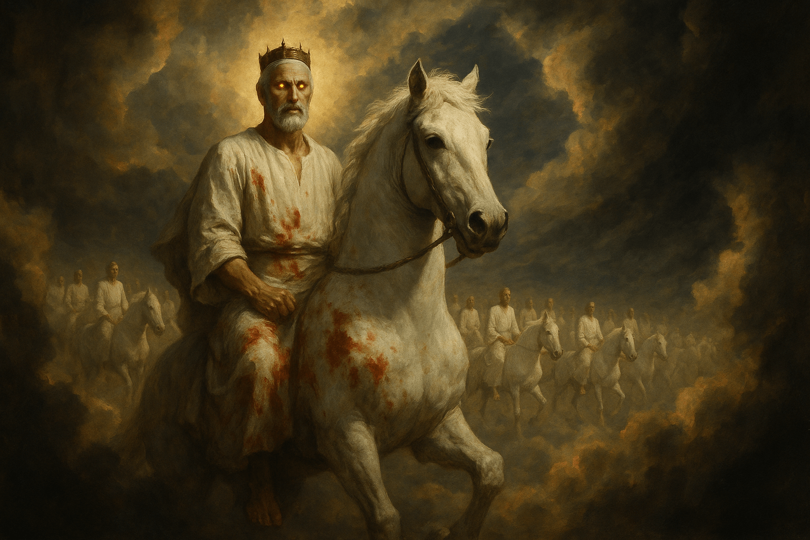

After writing about [Jesus the cloud rider](/2025/05/jesus-the-cloud-rider/) I started exploring three ways to add on to the article using AI. Music, Image and Conversation.

## Music

I Fed the full article to [ChatGPT](https://chatgpt.com/) and asked it to write the lyrics of a song in the style of Johnny Cash. I don't know if the style is right but I liked it. After a bit of manual editing, I ended up with this.

<pre>
I heard a voice like thunder roll, from the heavens to my soul,
He rides the clouds like the prophets told, with eyes of fire and a crown of gold,
The Alpha and Omega, the First and Last, He’s comin’ soon, the time is passin’ fast.

Chorus
Oh, Rider on the Clouds, He’s comin’ down,
With a sword in His mouth and a golden crown.
Every eye will see, every knee will bow,
Jesus is the Lord, He’s ridin’ now.

He walked the earth, they pierced His side, on a rugged cross, the King did die.
But death couldn’t hold Him, He broke the chain, now He’s alive and He’s comin’ again.
His voice like waters, roarin’ through the land, holdin’ death and hell in His mighty hand.

Chorus
Oh, Rider on the Clouds, He’s comin’ down,
With a sword in His mouth and a golden crown.
Every eye will see, every knee will bow,
Jesus is the Lord, He’s ridin’ now.

So don’t you fear when the shadows fall, when the trumpets sound and the nations call.
He’s got the keys to the grave and more, He’s the livin’ God, forevermore.
Sing to the One who rides the skies, The Lord of Hosts with fire in His eyes.

Chorus
Oh, Rider on the Clouds, He’s comin’ down,
With a sword in His mouth and a golden crown.
Every eye will see, every knee will bow,
Jesus is the Lord, He’s ridin’ now.
</pre>

Then I fed it to [Suno](suno.com), and I got some really bad songs. I tweaked a bit the direction of the style of song I wanted and had a really good one. I used that one as basis and did a "Remix", where i can take a song and use it as an inspiration for new ones. This is the result. I like it a lot. Especially the chorus

<iframe src="https://suno.com/embed/c315c147-7b54-4b04-8c4d-c7c6a04f34a9" width="100%" ><a href="https://suno.com/song/c315c147-7b54-4b04-8c4d-c7c6a04f34a9">Listen on Suno</a></iframe>

## Image

This one was a bit more difficult. I wanted to generate an image of Jesus opening the skies on a white horse, with fire in the eyes, a white robe stained with blood, and a procession of riders behind him. I tried a bunch of models, describing vaguely what I wanted, and the results were terrible. Gory images, blood everywhere, armies with lots of weapons and armour, the scene on the ground instead of the clouds, I couldn't get the AI to generate what I wanted. I needed to work a lot on the prompt. The one that gave the best results was [Sora](https://openai.com/index/sora/). This is the image that best resembled what I had in mind.

Click these links [to see](almost.png) [some of the other](not-really-what-i-wanted.jpg) [images that](second-best.webp) [I didn't like](too-much-blood.jpg)

## Conversation

It was suggested to me that I could start a podcast with my articles. It's so easy it's unbelieveable. I used [NotebookLLM](https://notebooklm.google.com/). This can create a podcast like conversation between 2 or more persons, discussing whatever webpages you feed it.

<audio controls><source src="podcast.mp3" type="audio/mpeg"></audio>

I'm still in shock thinking how easy it was to create all of this...